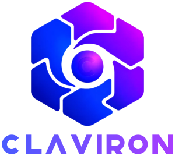

  

# Claviron

Claviron is an embeddable Rust facade and crate family for building fleet-aware application servers. The application owns its binary, configuration, routing policy, and business logic; Claviron supplies the runtime kernel and server fabric around it.

## Build the server around the application

Claviron can terminate HTTP directly and compose transport, TLS, virtual hosts, routing, static files, upstreams, runtime adapters, and application code in one server. Typed state can move across these layers without an extra application-protocol hop.

Each route can be owned by:

- native Rust code, with optional fallback to the existing application;
- an existing HTTP application reached through Claviron's reverse-upstream dispatch;
- a persistent JavaScript or TypeScript application on the embedded `deno_core` runtime;
- an in-process Python ASGI application with lifespan ownership;
- embedded PHP as a request-scoped script, persistent application, or background task;
- PHP-FPM over FastCGI when process isolation or remote PHP is preferred;
- a native C ABI handler implemented in C, C++, or a Go `c-shared` library.

Embedded PHP and FastCGI may be mixed route by route. More importantly, an existing application can keep running while only its critical paths move to Rust, or while the entire application is migrated gradually over time. Teams choose the boundary and the pace; Claviron does not require an all-at-once rewrite.

Foreign handlers remain behind Claviron's HTTP boundary. The application or a routable provider loads the shared library, mounts its route set, and delegates only the selected work through Claviron's buffered or streaming FFI contract. Any language capable of exposing a C ABI can therefore be embedded as a Claviron-managed service or handler. Its provider joins the same lifecycle while Claviron continues to own transport, TLS, virtual hosts, routing, memory hand-off, and graceful shutdown.

## Service orchestration across runtimes

Claviron orchestrates services as well as applications and tasks. [Continuo](https://crates.io/crates/continuo) ([source](https://github.com/iadev09/continuo)) provides the typed, process-local service registry and owns provider boot, validation, reload, runnable generations, graceful drain, and finalization. Every managed component can resolve its dependencies and participate in the same lifecycle instead of creating a parallel service container.

The Claviron supervisor turns the runtime into a managed master/worker topology. It monitors liveness, replaces failed workers, and performs rolling restart and rotation while preserving worker-fleet continuity. With multiple workers, this creates a same-host high-availability model for routine operations; the external service manager remains responsible for master or host failure.

Orbit binds the published [Orbitive](https://crates.io/crates/orbitive) project ([source](https://github.com/iadev09/orbitive)) and its POSIX shared-memory primitives into that lifecycle. It provides the same-host fleet with typed events, cache propagation, counters, locks, invocation transport, and operational snapshots without turning language runtimes into transport owners.

## From a monolith to a managed fleet

The same components can run inside one application-owned monolith or be divided among smaller, purpose-specific Claviron instances. Standalone, master, and worker modes make it possible to shape an environment around the application instead of forcing the application into one deployment architecture.

Workloads may run in-process, in standalone mode, across a supervised multi-worker fleet, or as dedicated runner processes. FastAPI and Django applications can use the ASGI boundary, Laravel can use embedded PHP or PHP-FPM, and Deno or slim JavaScript applications can run through their own runtime adapters. Edge provides HTTP ingress and route dispatch, while Orbit protocols provide same-host shared-memory coordination and transport between participating Claviron processes.

Services, scheduled or long-running tasks, web applications, and worker fleets share a typed management plane. They can be observed and controlled remotely through management APIs and a GUI, while lifecycle commands and status views continue to use the runtime's authoritative state.

## Composable and embeddable by design

Claviron is a set of interoperable pieces rather than a prescribed stack. A project may embed only the provider runtime, use the transport-neutral server lifecycle, select the complete HTTP edge composition, or consume an individual subsystem. Supervisor, HTTP/TLS, language runtimes, tasks, Orbit, and management can be assembled like building blocks around the application.

Python, JavaScript, PHP, tasks, foreign modules, and native Rust services remain separate runtime boundaries while sharing one application-owned server. Pieces can be introduced, replaced, or split into dedicated Claviron instances as the system evolves.

The project is under active development.

This crate currently reserves the official package name. Please do not depend on it yet; the first public release will follow when the project is ready.
